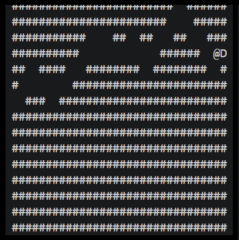

Custom 16 bit assembler and emulator, compiles files written in the x16 assembly language to binary objects, and runs them.

# X16



How It Works:

The x16s programming langauge contains 17 different 16 bit instructions, each containing an opcode and bits to store the memory locations and variables necessary to implement the instructon. X16 has its own memory address space with pre-defined space for the OS, user programs, and system registers. Any program written using correct x16s syntax can be compiled using `xas.c`. The assembler implements two pass assembly to store the memory locations of all labels, tokenize the program, step through, and emit a 16 bit binary string for each valid instruction. Any binary object combiled by `xas.c` can be executed using `x16.c`. The bitwise logic for the instructions is implimented and can be viewed in `control.c`.

Usage:

The project can be built by running:
```
make
```
There is a short test program called `giza.x16s` that can be compiled into `a.obj` by running:
```
./xas giza.x16s
```
You can run the executable with:
```
./x16 a.obj
```
There is also a game called rogue that can run on x16:
```
./x16 rogue.obj
```
